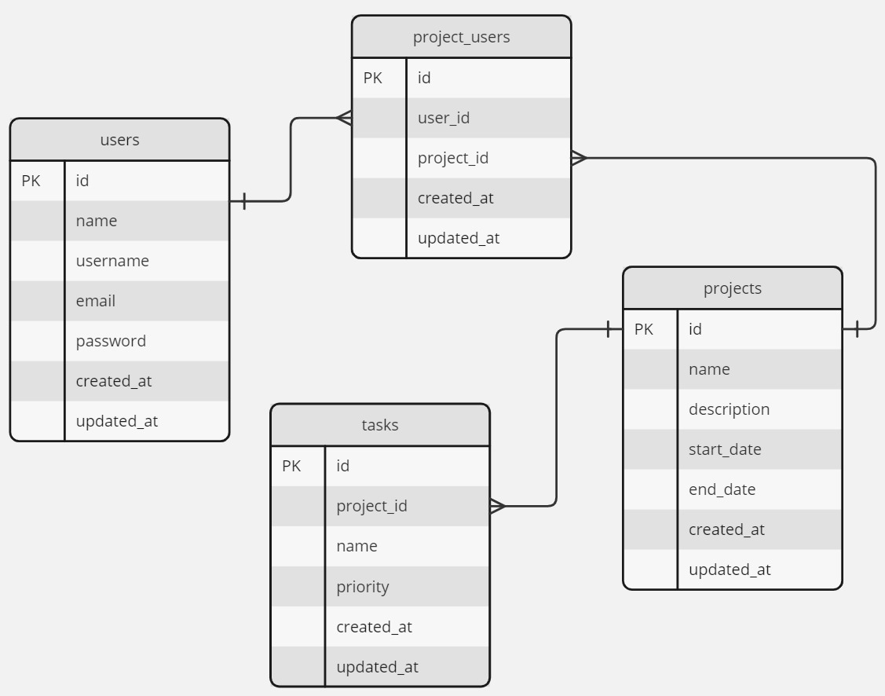

# 
  Welcome to Task Management  

## ⛷️ About Task Management
Hello there! This is my task management application. Task management involves planning, organizing, and overseeing tasks to achieve specific goals efficiently. The application was built with the Laravel framework, and there are some features, including creating, updating, deleting projects and tasks.

## 🚀 Key Features

<h4>Project Creation and Management:</h4>
Users have the ability to create projects with customizable details such as project name, description, insert multiple members associated with the project, input the start date, and the end date. Additionally, users can input multiple tasks associated with each project. I use DataTables for the table, select2 for the dropdown option, and write original syntax using jQuery to append multiple input tasks.

<h4>Priority Reordering:</h4>
The application facilitates easy reordering of task priorities through a user-friendly drag-and-drop interface. I use jQuery and AJAX to build this reordering priority and compile it to the DataTables. 

 
Feel free to explore and experience the convenience of managing your projects and tasks efficiently! 💁‍♀️

### 📖 Technologies I've used:
- HTML
- CSS
- Bootstrap
- Datatables
- JavaScript
- jQuery
- AJAX
- MySQL
- Git
- GitHub

### 🕹️ GitHub Link:
- https://github.com/annisarisma/task-management.git

 

### 📁 ERD
I use Miro to design the database, and it's as simple as this.

## 🎮 Let's Start!
1. composer update
2. cp .env.example .env
3. php artisan key:generate
4. php artisan migrate
5. php artisan db:seed
6. php artisan serve

###  A Small Addition
I have implemented a simple user authentication system to associate members with other users. You can log in using the username and password created by the seeder. Additionally, I have generated a fake account for another user.

- user 1 👨‍🦰: username: johndoe, password: 12345678

### ➕➕➕✍️🙋‍♀️ PS Notes!
I've created some issues that you can check out in the GitHub issue menu. It shows my initial commit from the beginning, accompanied by a detailed message explaining my commits and changes. Feel free to follow my journey in building this app through the commit references listed there. Enjoy!